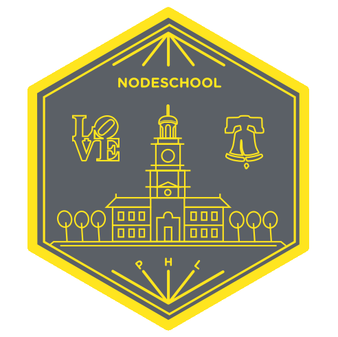

# NodeSchool Philadelphia

This repo is for the general planning of the lessons and materials which will be covered in the planned year of NodeSchool events starting in January 2016.

Events will still be announced through the regular channels.
